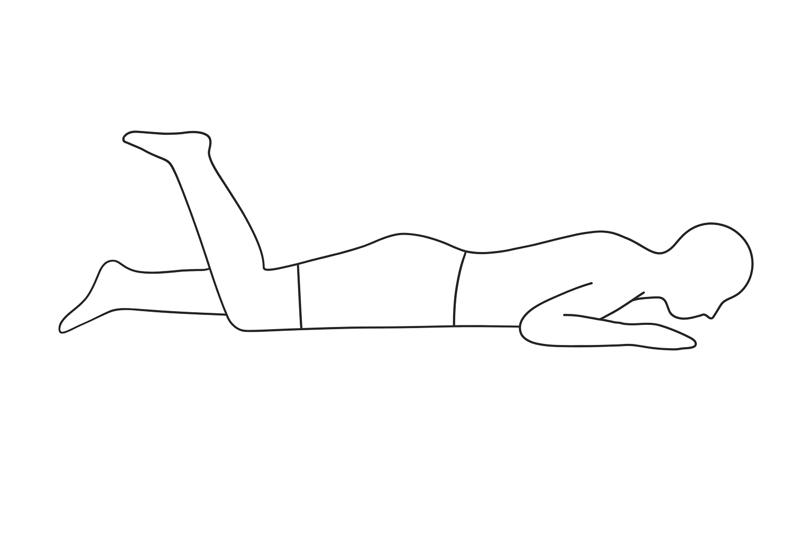
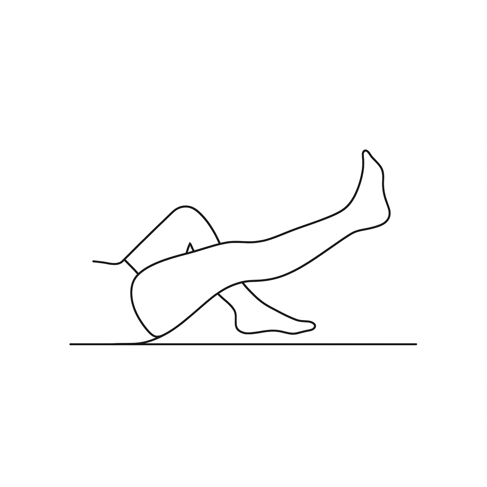
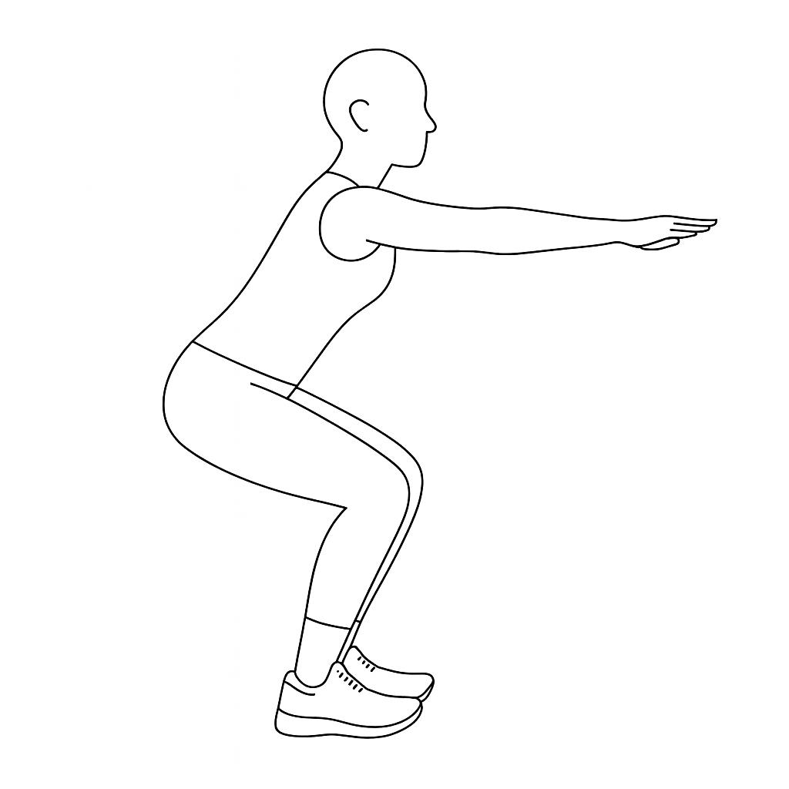

# PainOptix™ Upper Lumbar Radiculopathy Monograph

**Upper Lumbar Nerve-Related Discomfort Edition**

## Section 1: Understanding Lumbar Radiculopathy Symptoms and Next Steps

### Understanding Back and Leg Discomfort: Information About Movement

You've taken an important step toward improving your comfort by exploring how your symptoms align with common patterns. Based on your PainFinder™ quiz responses, your symptoms resemble those often linked to nerve-related discomfort in the upper lumbar spine (L2, L3, or L4), causing leg pain or issues with knee movement. This guide, crafted by Dr. Carpentier at DrCPainMD, aims to:
- Explain what your symptoms might suggest.
- Provide educational information for educational purposes.
- Offer tools like a 14-day tracker to monitor your progress and connect with others via PainCrowdsource.org.
- Prepare you to discuss your symptoms with a healthcare provider for further evaluation.

### What Your Symptoms Might Mean

Your symptoms align with a pattern often seen in adults with nerve-related back and leg discomfort, including:
- Discomfort Location: Low back with radiation to the front or inner thigh, or inner shin.
- Worse With: Prolonged sitting, standing, or activities involving hip or knee movement (e.g., climbing stairs).
- Better With: Lying flat, gentle walking, or changing positions.
- Functional Impact: Able to walk but may struggle with knee movement or prolonged postures.
- Numbness/Tingling: Possible in the thigh or shin.
- No Urgent Symptoms Reported.

These symptoms may suggest irritation in the upper lumbar spine, often linked to aging, repetitive stress, or posture [Deyo et al., 2006]. Similar discomfort can arise from other causes, like hip issues or muscle strain, so a healthcare provider's evaluation, possibly with imaging, is needed to clarify the cause [Vroomen et al., 2002]. This guide offers general strategies to support movement and comfort, which are used by some people with similar symptoms (e.g., some people report improvement with movement [Qaseem et al., 2017]).

### Your Next Steps

- Consider the movement and posture tips in this guide to stay active and ease discomfort.
- You may use the 14-day tracker (Section 14) to log your progress.
- Share anonymized experiences on PainCrowdsource.org to learn from others.
- Discuss your symptoms with a healthcare provider for a thorough evaluation.

## Section 2: Exploring Nerve-Related Back and Leg Discomfort

### The Spine, Simplified

Your lumbar spine has five vertebrae, supported by:
- Intervertebral Discs: Cushions for flexibility and shock absorption [Adams & Roughley, 2006].
- Facet Joints: Guide spinal motion.
- Nerve Roots: Exit the spine to serve specific leg regions [Tarulli & Raynor, 2007].

### What Might Cause Your Symptoms?

Upper lumbar nerve irritation can result from:
- Disc Herniation: Material pressing on L2, L3, or L4 nerve roots.
- Foraminal Stenosis: Narrowing of nerve exit pathways.
- Facet Arthropathy: Joint enlargement compressing nerves.
- Spondylolisthesis: Vertebral slippage affecting nerve space [Kreiner et al., 2014].

### Nerve Distribution Patterns

- L2: Front and inner thigh.
- L3: Front thigh to knee, inner knee.
- L4: Inner shin to inner ankle [Tarulli & Raynor, 2007].

Understanding your pattern helps target management approach approaches.

## Section 3: What Is Upper Lumbar Radiculopathy?

Upper lumbar radiculopathy involves irritation of the L2, L3, or L4 nerve roots, less common than lower lumbar (L5/S1) issues but with distinct patterns.

### Common Features

- Front or inner thigh pain, possibly to knee or shin.
- Weakness in hip flexion or knee extension.
- Numbness/tingling in specific areas.
- Pain worse with certain positions.
- May affect walking upstairs or rising from chairs.
- Less common than sciatica but still significant [Tarulli & Raynor, 2007].

### How Symptoms Behave

- Dermatomal: Following specific nerve pathways.
- Position-Dependent: Better or worse with certain postures.
- Activity-Related: Stairs, squatting may be challenging.
- Variable: Good days and difficult days common.

A PainCrowdsource.org user improved stair climbing ability by 70% in 6 weeks with targeted exercises. Track your patterns on PainCrowdsource.org.

## Section 4: Your Unique Symptom Pattern

Your PainFinder™ responses suggest upper lumbar nerve involvement, likely L2-L4 based on your symptom distribution.

### Key Features

- Pain in front/inner thigh or shin area.
- Possible knee weakness or buckling.
- Difficulty with stairs or rising from seated position.
- Relief with certain positions.
- Symptoms following specific nerve pathways.

### Why This Matters

This pattern guides:
- Exercise Selection: Nerve-specific movements.
- Position Strategies: Finding relief postures.
- Functional Focus: Addressing specific limitations.

Understanding your pattern helps optimize management approach approaches.

## Section 5: When to See a Doctor

Most upper lumbar radiculopathy may improve with conservative care, but seek evaluation for:

- Progressive Weakness: Worsening leg strength, especially knee buckling.
- Bowel/Bladder Changes: Difficulty with control—seek emergency care.
- Severe Pain: Unrelenting despite position changes.
- No Improvement: After 4-6 weeks of appropriate care.
- Falls: Due to leg weakness or giving way.
- Fever or Weight Loss: May indicate other conditions.

Document symptoms on PainCrowdsource.org to share with your provider.

## Section 6: Why Movement Helps

Movement is crucial for nerve health and recovery from radiculopathy.

### Benefits for Nerve Health

- Improves nerve blood flow and nutrition.
- Reduces adhesions and scar tissue.
- Maintains nerve mobility.
- Strengthens supporting muscles [Nee & Butler, 2006].

### Types of Helpful Movement

- Nerve Glides: Gentle movements to mobilize nerves.
- Strengthening: Targeted to weak muscle groups.
- Flexibility: Maintaining range of motion.
- Aerobic: Walking, swimming for overall health.

### Movement Principles

- Start gentle, progress gradually.
- Avoid positions that sharply increase leg symptoms.
- Some tingling during nerve glides is normal.
- Consistency is key for improvement.

A PainCrowdsource.org user regained full strength after 8 weeks of consistent nerve mobilization exercises. Share your progress on PainCrowdsource.org.

## Section 7: Your 4-Week Movement Program

### Targeted Exercises for Upper Lumbar Nerve Health

This program addresses the unique needs of upper lumbar radiculopathy, focusing on nerve mobility and strength.

### General Guidelines

- Perform exercises gently, respecting symptoms.
- Mild tingling during nerve glides is acceptable.
- Stop if sharp pain or significant weakness occurs.
- Progress based on tolerance.

### Week 1: Gentle Mobilization

- Goals: Reduce nerve irritation, maintain mobility.
- Knee to Chest: Single leg, gentle stretch. Hold 20 seconds, 5 reps each, 2x daily.
- Nerve Glide - Femoral: Lying on side, gently bend knee back. 10 reps, 2x daily.
- Walking: 5-10 minutes, 2-3x daily, flat surfaces.
- Hip Flexor Stretch: Gentle lunge position. Hold 20 seconds, 3 reps each, 2x daily.

### Week 2: Progressive Mobility

- Goals: Increase nerve tolerance, begin strengthening.
- Prone Knee Bends: Lying face down, slowly bend knee. 10 reps each, 2x daily.

- Standing Hip Flexion: Gentle marching. 15 reps each, 2x daily.

- Bridges: Focus on gluteal activation. 12 reps, 2 sets, 2x daily.
- Walking: Increase to 15 minutes, 2x daily.

### Week 3: Strength Building

- Goals: Address muscle weakness, improve function.
- Straight Leg Raises: Lying, lift leg 6-8 inches. 10 reps each, 2 sets, 2x daily.

- Wall Sits: Start with 10-15 seconds. 5 reps, 2x daily.
- Step-Ups: Low step, focus on control. 8 reps each, 2x daily.
- Walking: 20-25 minutes daily, include gentle inclines.

### Week 4: Functional Integration

- Goals: Return to normal activities, prevent recurrence.
- Mini Squats: Quarter depth, good form. 15 reps, 2 sets, 2x daily.

- Standing Balance: Single leg, 30 seconds each, 2x daily.

- Stair Practice: Controlled ascent/descent, use rail initially.
- Activity-Specific Training: Practice problematic movements.

**Tip:** For nerve glides, movement should be smooth and rhythmic, not forced. Log progress on PainCrowdsource.org.

## Section 8: Posture and Position Strategies

Proper positioning may reduce nerve irritation and promotes healing.

**Sitting:**
- Avoid prolonged hip flexion.
- Use footrest to reduce hip angle.
- Stand and move every 20-30 minutes.
- Consider standing desk option.

**Standing:**
- Avoid prolonged static standing.
- Shift weight regularly.
- Use footstool to alternate leg positions.
- Maintain neutral spine.

**Sleeping:**
- Side-lying with pillow between knees.
- Avoid extreme hip flexion.
- Back sleeping with knees slightly elevated.
- Firm mattress generally helpful.

**Daily Activities:**
- Modify stair climbing technique (step-to pattern if needed).
- Use proper body mechanics for lifting.
- Avoid deep squatting initially.
- Break activities into manageable segments.

PainCrowdsource.org users report 60% less pain with consistent position modifications. Share your strategies on PainCrowdsource.org.

**Key Takeaway:** Small position changes can significantly reduce nerve irritation.

## Section 9: Symptom Management Strategies

Complement your movement program with these approaches:

- Heat: Before exercises to improve tissue mobility.
- Ice: For acute flares, 15 minutes maximum.
- Nerve Gliding: Throughout the day for symptom relief.
- Gentle Stretching: Hip flexors, quadriceps, hamstrings.
- Relaxation Techniques: Reduce muscle guarding.
- Activity Pacing: Balance activity with rest.

Avoid:
- Prolonged positions that increase symptoms.
- Aggressive stretching of irritated nerves.
- Complete inactivity.

Track effective strategies on PainCrowdsource.org.

**Key Takeaway:** Multiple gentle approaches work better than single aggressive interventions.

## Section 10: Medications and Supplements

Consult your healthcare provider about appropriate options.

### Medications

- NSAIDs: For inflammation around nerve roots.
- Neuropathic Medications: Gabapentin, pregabalin for nerve pain.
- Muscle Relaxants: If significant muscle spasm.
- Oral Steroids: Sometimes used for acute flares.

### Supplements

- B-Complex Vitamins: Support nerve health.
- Alpha-Lipoic Acid: Antioxidant for nerve function.
- Omega-3 Fatty Acids: Anti-inflammatory effects.
- Vitamin D: If deficient, affects nerve health.

Monitor medication responses on PainCrowdsource.org.

**Key Takeaway:** Medications support but don't replace active management.

## Section 11: Advanced Management Approach Options

When conservative care isn't sufficient:

### Injections

- Epidural Steroid Injections: Target inflammation at nerve root.
- Selective Nerve Root Blocks: Diagnostic and therapeutic.
- Facet Joint Injections: If joint-related compression.

### Advanced Therapies

- Physical Therapy: Specialized nerve mobilization techniques.
- Spinal Decompression: Non-surgical traction therapy.
- Acupuncture: Some find relief for nerve symptoms.

### Surgery (Rare for Upper Lumbar)

- Microdiscectomy: Remove compressing disc material.
- Laminectomy: Create space for nerves.
- Fusion: If instability present.

Most improve without surgery. Track all treatments on PainCrowdsource.org.

**Key Takeaway:** Exhaust conservative options before considering invasive treatments.

## Section 12: Recovery Timeline and Expectations

Understanding typical recovery helps set realistic goals:

### Acute Phase (Weeks 1-2)

- Focus on pain reduction and gentle movement.
- Nerve symptoms may fluctuate.
- Avoid aggravating activities.

### Recovery Phase (Weeks 3-6)

- Gradual strength improvement.
- Increased activity tolerance.
- Nerve symptoms should centralize.

### Strengthening Phase (Weeks 7-12)

- Progressive return to normal activities.
- Focus on preventing recurrence.
- Most see significant improvement.

### Maintenance Phase (Ongoing)

- Continue preventive exercises.
- Monitor for early warning signs.
- Maintain healthy lifestyle.

Studies show 60-80% may experience improvement significantly within 12 weeks [Vroomen et al., 2002]. Share your timeline on PainCrowdsource.org.

**Key Takeaway:** Recovery is gradual but expected with consistent effort.

## Section 13: Living Well with Nerve Symptoms

Long-term strategies for optimal function:

### Exercise Maintenance

- Continue nerve glides 2-3x weekly.
- Maintain core and leg strength.
- Regular walking or swimming.
- Flexibility work for hips and spine.

### Lifestyle Modifications

- Ergonomic workstation setup.
- Proper footwear for support.
- Weight management if needed.
- Stress reduction techniques.

### Early Warning Signs

- Return of specific leg symptoms.
- Weakness in previously affected muscles.
- Increased back stiffness.
- Difficulty with stairs or rising.

### Flare Management

- Return to gentle exercises immediately.
- Avoid provocative positions.
- Use proven relief strategies.
- Seek help if symptoms persist.

**Key Takeaway:** Proactive management prevents chronic issues.

## Section 14: 14-Day Symptom & Movement Tracker

### Monitor Your Nerve Recovery

Daily tracking helps identify patterns and progress.

### Daily Tracking Points

- Pain Location: Back, thigh, knee, shin (mark all).
- Pain Intensity (0-10): For each location.
- Numbness/Tingling: Location and severity.
- Weakness: Specific movements affected.
- Activities Limited: What you couldn't do.
- Exercises Completed: Which ones, how many.
- Relief Strategies Used: What helped.

### 14-Day Template

**Day 1:**
- Pain Locations: ________________
- Pain Scores: Back ___ Thigh ___ Knee ___ Shin ___
- Numbness/Tingling: _____________
- Weakness: _____________________
- Limited Activities: ____________
- Exercises: ____________________
- What Helped: __________________

(Repeat for Days 2-14)

### Tracking Benefits

- Identifies improvement patterns.
- Shows which exercises help most.
- Documents progress for provider.
- Motivates continued effort.

**Tip:** Use smartphone photos of your tracker for easy sharing on PainCrowdsource.org.

## Section 15: Creating Your Success Plan

### Immediate Actions (This Week)

1. Start gentle exercises from Week 1.
2. Implement position modifications.
3. Begin daily symptom tracking.
4. Schedule healthcare provider visit if needed.

### Short-term Goals (Weeks 2-4)

1. Progress through exercise program.
2. Identify most helpful strategies.
3. Gradually increase activity level.
4. Connect with PainCrowdsource.org community.

### Long-term Planning (Months 2-3)

1. Return to normal activities.
2. Establish maintenance routine.
3. Share success story to help others.
4. Plan prevention strategies.

### Keys to Success

- Consistency over intensity.
- Listen to your body's signals.
- Celebrate small improvements.
- Stay connected for support.

**Key Takeaway:** Your active participation drives recovery.

## Closing Thoughts

### Your Recovery Journey

Upper lumbar radiculopathy can be challenging, but recovery is expected. Remember:
- Most people improve with conservative care.
- Your symptoms have known patterns and solutions.
- Active participation accelerates healing.
- You're not alone in this journey.

Share your experiences on PainCrowdsource.org to both learn and teach. Your insights could be the key to someone else's recovery.

Stay hopeful, stay active, and trust the process.

-The PainOptix Team

>>BIBLIOGRAPHY
1. Adams, M. A., & Roughley, P. J. (2006). What is intervertebral disc degeneration? Spine, 31(18), 2151-2161.
>>END
2. Deyo, R. A., et al. (2006). Low back pain. New England Journal of Medicine, 344(5), 363-370.
3. Kreiner, D. S., et al. (2014). An evidence-based clinical guideline for the diagnosis and treatment of lumbar disc herniation with radiculopathy. The Spine Journal, 14(1), 180-191.
4. Nee, R. J., & Butler, D. (2006). Management of peripheral neuropathic pain. Physical Therapy, 86(12), 1614-1627.
5. Qaseem, A., et al. (2017). Noninvasive treatments for acute, subacute, and chronic low back pain. Annals of Internal Medicine, 166(7), 514-530.
6. Tarulli, A. W., & Raynor, E. M. (2007). Lumbosacral radiculopathy. Neurologic Clinics, 25(2), 387-405.
7. Vroomen, P. C., et al. (2002). Conservative treatment of sciatica: A systematic review. Journal of Spinal Disorders, 15(1), 63-70.

## Notice

This guide is for educational purposes only. Always consult a healthcare provider for educational advice and before making health-related decisions.
